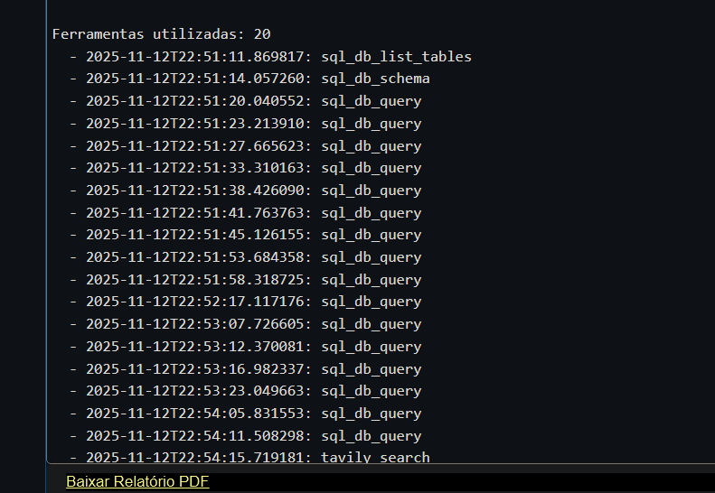
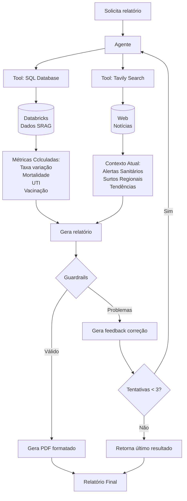

# Sistema de análise epidemiológica SRAG com IA Generativa

## Visão Geral

Sistema baseado em Inteligência Artificial Generativa que gera relatórios epidemiológicos automatizados sobre Síndrome Respiratória Aguda Grave (SRAG), combinando dados históricos de um banco de dados SQL com notícias em tempo real para fornecer análises contextualizadas e métricas relevantes para profissionais de saúde.

## Arquitetura da solução

### Componentes principais

**1. Agente (Claude Sonnet 4)**
- LLM: Claude Sonnet 4 (claude-sonnet-4-20250514)
- Framework: LangChain + LangGraph

**2. Ferramentas (Tools)**

**SQL Database Toolkit**
- Conexão com Databricks via SQLAlchemy
- Queries otimizadas para métricas epidemiológicas

**Tavily Search**
- Busca de notícias em tempo real
- Configuração: Brasil, max 5 resultados
- Termos: "SRAG Brasil", "surto respiratório", "alertas sanitários"

**3. Sistema de Guardrails**
- Validação automática de métricas obrigatórias
- Verificação de seções do relatório
- Loop de auto-correção
- Feedback estruturado para o agente

## Exemplo de execução


[Relatório gerado](./relatorio_srag.pdf)

### Fluxo de Execução



## Métricas implementadas

### 1. Taxa de variação de casos
- Comparação semanal/mensal
- Identificação de tendências (crescimento/redução)

### 2. Taxa de mortalidade
- Total de casos vs óbitos
- Percentual de letalidade
- Período: últimos 30-60 dias

### 3. Taxa de ocupação de UTI
- Casos que necessitaram UTI
- Indicador de gravidade dos casos
- Análise temporal

### 4. Taxa de vacinação
- Cobertura vacinal da população afetada
- Correlação com gravidade dos casos

## Tratamento de Dados Sensíveis

### Segurança de Credenciais
```python
DATABRICKS_TOKEN = dbutils.secrets.get(scope="srag_agent", key="DATABRICKS_TOKEN")
ANTHROPIC_API_KEY = dbutils.secrets.get(scope="srag_agent", key="ANTHROPIC_API_KEY")
TAVILY_API_KEY = dbutils.secrets.get(scope="srag_agent", key="TAVILY_API_KEY")
```

### Proteção de dados
- Queries com LIMIT para evitar sobrecarga
- Sem exposição de dados individuais
- Conformidade com LGPD (dados anonimizados)

### Sanitização de Inputs
```python
# Queries SQL parametrizadas
# UPPER(CAST(...)) para normalização
# Validação de datas com DATE_SUB
# Prevenção de SQL Injection
```